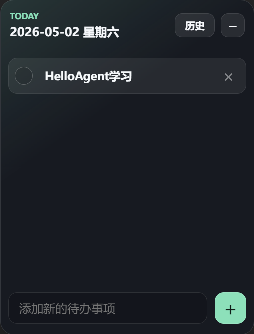
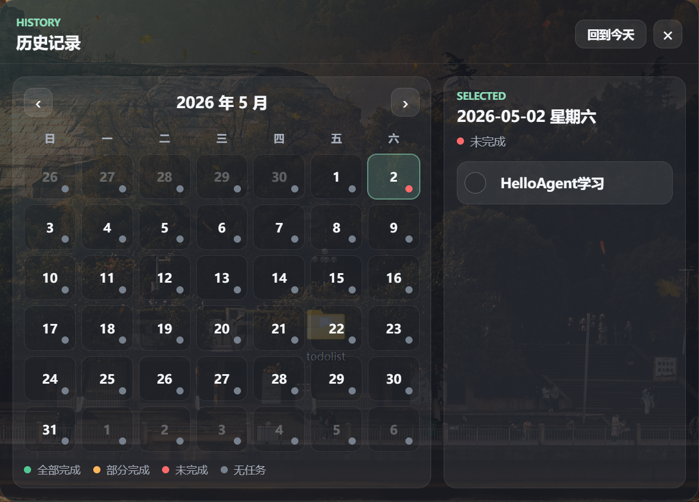

# EasyToDo

一款基于 Electron 的桌面待办清单。应用启动后默认进入系统托盘，不显示任务栏图标；从托盘打开窗口后仍保持置顶、无边框、半透明，支持拖拽移动、调整大小、每日任务持久化和历史日历查看。

## 运行截图





## 运行

```powershell
npm.cmd install
npm.cmd start
```

在 PowerShell 禁止脚本执行的环境中，请使用 `npm.cmd`，不要直接运行 `npm`。

## 打包

```powershell
npm.cmd run dist
```

生成的安装包位于 `dist/EasyToDo Setup 1.0.2.exe`。

仓库中的 `release/EasyToDo Setup 1.0.2.exe` 是已打包好的 Windows 安装程序。

## 设置

主窗口顶部的“设置”按钮和托盘菜单都可以开启或关闭“开机自启”。开启后，EasyToDo 会在系统启动时自动进入托盘。

## 数据存储

任务数据会保存到 Electron 的用户数据目录下，文件名为 `tasks.json`。数据按日期键组织，例如：

```json
{
  "2026-05-02": [
    {
      "id": "example",
      "text": "完成待办软件",
      "completed": false,
      "createdAt": 1777710000000
    }
  ]
}
```
